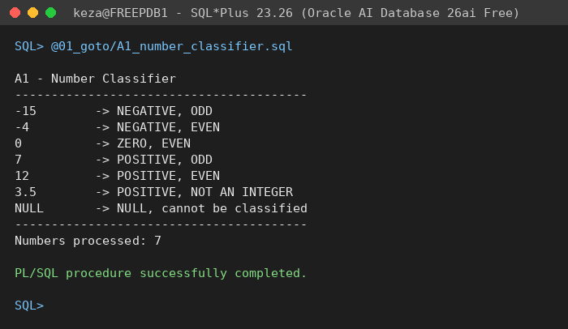
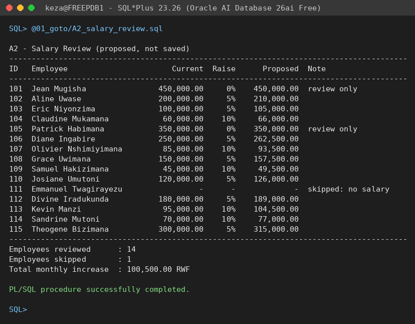
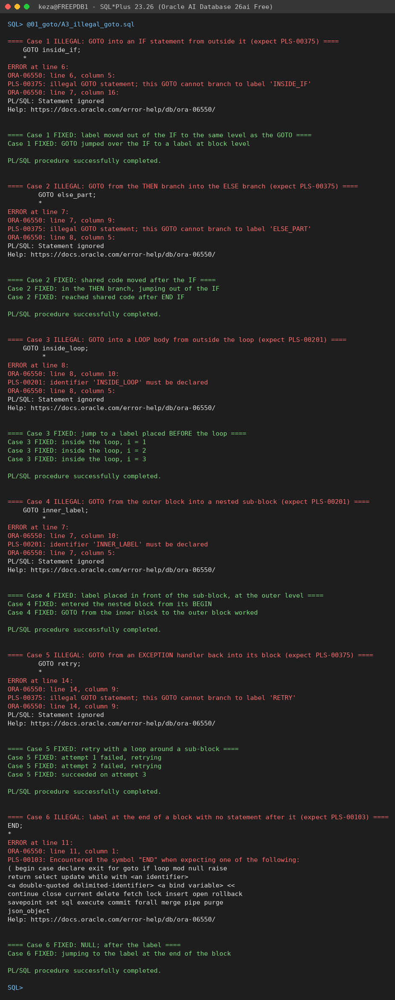
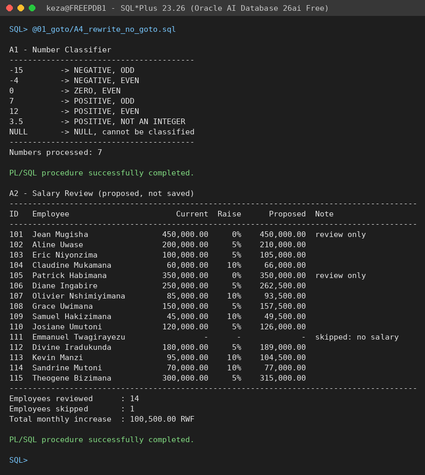
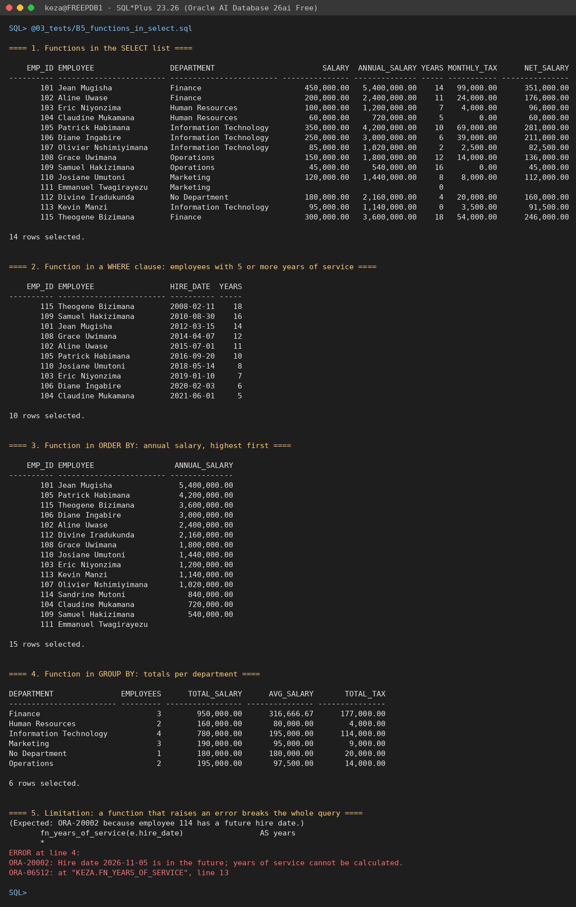
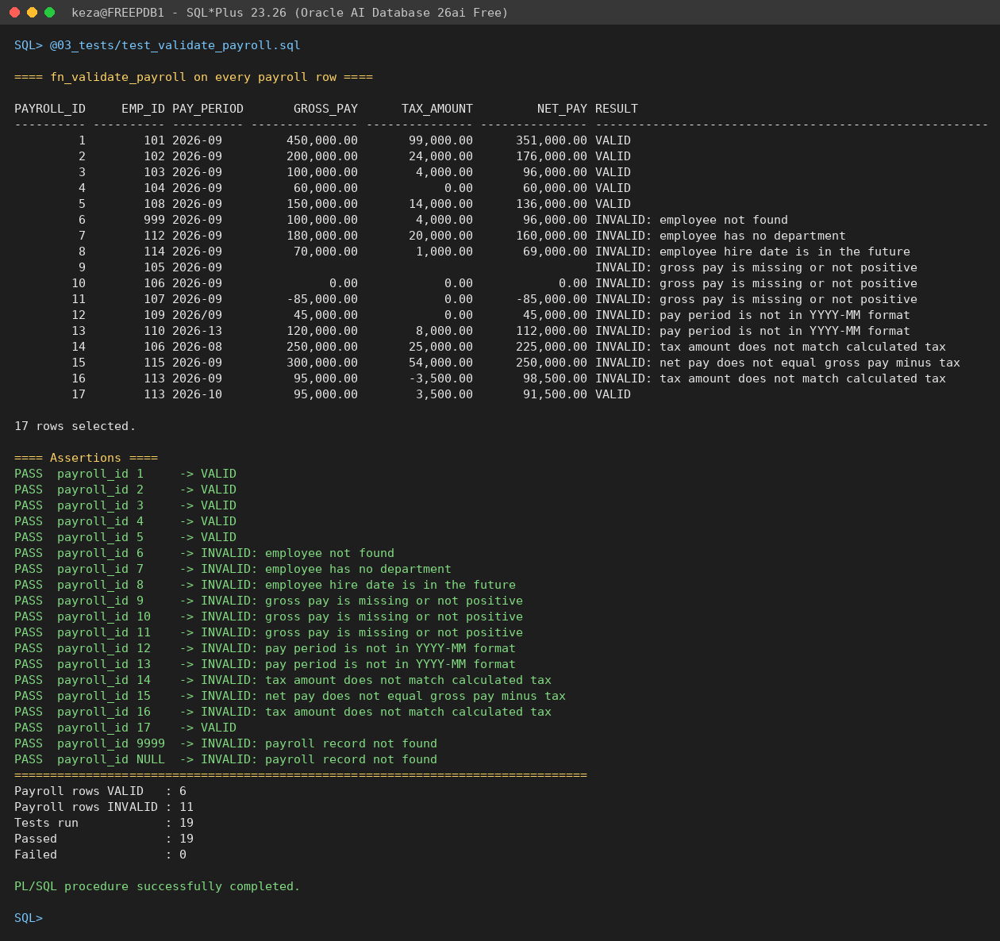

# PL/SQL GOTO Statements and Functions

| | |
|---|---|
| **Student** | Keza Christa Clea |
| **Student ID** | 29570 |
| **Course** | INSY 8311 – Database Development with PL/SQL |
| **Institution** | Adventist University of Central Africa (AUCA) |
| **Instructor** | Eric Maniraguha |
| **Assignment** | Individual Assignment III: PL/SQL GOTO Statements and Functions |
| **Deadline** | Thursday, 8 October 2026, 11:59 PM |

## Overview

This assignment practises five things:

1. **GOTO statements**: jumping to labels, and the rules that make a GOTO legal or illegal (Part A).
2. **Stored functions**: `CREATE OR REPLACE FUNCTION` with parameters, return values, `%TYPE` anchoring and input validation (Part B).
3. **Exception handling**: `NO_DATA_FOUND`, `RAISE_APPLICATION_ERROR`, and choosing between returning `NULL` and raising an error.
4. **Functions used in SQL**: calling my own functions in `SELECT`, `WHERE`, `ORDER BY` and `GROUP BY` (B5).
5. **GitHub organisation and documentation**: a fixed repository layout, a commented header in every script, and step-by-step commits.

The data is a small HR and payroll schema in a Rwandan context. All money values are in RWF.

## Prerequisites

- **Database:** tested on Oracle AI Database 26ai Free (release 23.26) in Docker (`gvenzl/oracle-free:23-slim`). The scripts avoid 23ai-only syntax (no `DROP TABLE IF EXISTS`, no SQL `BOOLEAN` columns), so they also run on Oracle 19c and 21c.
- **Tool:** SQL\*Plus 23.26. SQLcl and Oracle SQL Developer (Run Script, F5) also work.
- **Account:** a schema with `CREATE TABLE` and `CREATE PROCEDURE` privileges.

## Repository Structure

```
plsql-goto-functions-29570-keza/
├── README.md
├── .gitignore
├── 00_setup/
│   └── create_tables.sql
├── 01_goto/
│   ├── A1_number_classifier.sql
│   ├── A2_salary_review.sql
│   ├── A3_illegal_goto.sql
│   └── A4_rewrite_no_goto.sql
├── 02_functions/
│   ├── B1_fn_annual_salary.sql
│   ├── B2_fn_years_of_service.sql
│   ├── B3_fn_calculate_tax.sql
│   ├── B4_fn_dept_name.sql
│   └── C1_fn_validate_payroll.sql
├── 03_tests/
│   ├── B5_functions_in_select.sql
│   ├── test_functions.sql
│   └── test_validate_payroll.sql
├── screenshots/
│   ├── A1_output.png
│   ├── A2_output.png
│   ├── A3_error_and_fix.png
│   ├── A4_output.png
│   ├── B5_select_output.png
│   └── C1_output.png
└── docs/
    └── REFLECTION.md
```

## How to Run

Connect with SQL\*Plus (or SQLcl) from the repository root, then run the scripts in this order:

1. Run `00_setup/create_tables.sql`.
   ```sql
   @00_setup/create_tables.sql
   ```
2. Run the functions in `02_functions/`. B1–B4 go first, because C1 calls them.
   ```sql
   @02_functions/B1_fn_annual_salary.sql
   @02_functions/B2_fn_years_of_service.sql
   @02_functions/B3_fn_calculate_tax.sql
   @02_functions/B4_fn_dept_name.sql
   @02_functions/C1_fn_validate_payroll.sql
   ```
3. Run the programs in `01_goto/`.
   ```sql
   @01_goto/A1_number_classifier.sql
   @01_goto/A2_salary_review.sql
   @01_goto/A3_illegal_goto.sql
   @01_goto/A4_rewrite_no_goto.sql
   ```
4. Run the test files in `03_tests/`.
   ```sql
   @03_tests/B5_functions_in_select.sql
   @03_tests/test_functions.sql
   @03_tests/test_validate_payroll.sql
   ```
5. Verify your results and screenshots.
   ```sql
   SELECT object_name, status FROM user_objects WHERE object_type = 'FUNCTION';  -- all VALID
   SELECT * FROM user_errors;                                                     -- no rows
   ```

Every script can be run again: the setup drops and recreates the tables, the functions use `CREATE OR REPLACE`, and the GOTO programs never change data.

### Sample data

The setup creates 5 departments, 15 employees and 17 payroll rows. The data deliberately includes these edge cases:

| Edge case | Where |
|---|---|
| Salary exactly on a tax or review boundary (60,000; 100,000; 200,000; 300,000) | employees 104, 103, 102, 115 |
| NULL salary | employee 111 |
| NULL department | employee 112 |
| Hired today (0 years of service) | employee 113 |
| Hire date in the future (data-entry error) | employee 114 |
| 10+ years of service | employees 101, 102, 105, 108, 109, 115 |
| Payroll rows that are each invalid for one specific reason | payroll 6–16 |

`payroll.emp_id` has no foreign key on purpose, so an "orphan" payroll row (employee 999) can exist and the validator has something to detect.

---

## Part A: GOTO

### A1: Number Classifier
`01_goto/A1_number_classifier.sql`

Loops over `SYS.ODCINUMBERLIST(-15, -4, 0, 7, 12, 3.5, NULL)`. For each number, GOTO jumps to one of `<<is_null>>`, `<<is_negative>>`, `<<is_zero>>` or `<<is_positive>>`. Negative and positive numbers then go to `<<check_parity>>` (even, odd, or not an integer), and every number ends at `<<classified>>` or `<<next_number>>`.

**Key concepts:**
- The per-number labels sit in one **inner block inside the loop**, so every GOTO is a jump within a single statement sequence.
- `GOTO next_number` jumps *out* of the inner block to the loop body, which is legal.
- `<<next_number>> NULL;` is needed because a label must be followed by an executable statement.



### A2: Salary Review
`01_goto/A2_salary_review.sql`

A cursor FOR loop goes through the employees in `emp_id` order and proposes a raise for each one: 10% below 100,000, 5% from 100,000 to 300,000, and no raise above 300,000 (review only). A NULL salary jumps to `<<skip_employee>>`. Every other path jumps to `<<print_result>>`, and then to `<<next_employee>> NULL;`. The summary shows 14 reviewed, 1 skipped, and a total increase of 100,500.00 RWF.

**Key concepts:**
- The thresholds are constants.
- Each GOTO jumps *out of* an IF branch into the loop body.
- Nothing is updated: the new salaries are only displayed.



### A3: Illegal GOTO and Fix
`01_goto/A3_illegal_goto.sql`

Six illegal cases, each in its own block and each followed by a fixed version. **The errors are intentional.**

| # | Illegal jump | Error (verified) | Fix |
|---|---|---|---|
| 1 | Into an IF from outside | PLS-00375 | Label moved to block level |
| 2 | From THEN into ELSE | PLS-00375 | Shared code placed after END IF |
| 3 | Into a LOOP body | PLS-00201 | Label placed before LOOP |
| 4 | Into a nested BEGIN…END | PLS-00201 | Label placed before the sub-block |
| 5 | From an EXCEPTION handler back into its block | PLS-00375 | Retry with a loop around a sub-block |
| 6 | Label just before END | PLS-00103 | `NULL;` after the label |

Cases 3 and 4 give **PLS-00201** ("identifier must be declared") rather than PLS-00375. A loop body and a sub-block each open their own label scope, so the GOTO cannot even see the label. A label inside an IF is in the same scope as the GOTO, so Oracle finds it and then rejects the jump with PLS-00375.



### A4: Rewrite Without GOTO
`01_goto/A4_rewrite_no_goto.sql`

Rewrites A1 and A2 using only `IF/ELSIF/ELSE`, `CASE`, `CONTINUE WHEN` and `EXIT WHEN`. There is no GOTO and no label. I diffed the output against the A1 and A2 output, and it is **identical**. The comment block at the end of the file compares the two styles.



---

## Part B: Functions

| Function | Signature | Returns | NULL / invalid / not found | Error codes |
|---|---|---|---|---|
| B1 | `fn_annual_salary(p_emp_id IN employees.emp_id%TYPE)` | `NUMBER`: salary × 12, rounded to 2 decimals | NULL id → NULL; employee not found → NULL; NULL salary → NULL | none |
| B2 | `fn_years_of_service(p_hire_date IN DATE)` | `NUMBER`: completed years | NULL → NULL; today → 0; future date → error | **-20002**: hire date is in the future |
| B3 | `fn_calculate_tax(p_monthly_salary IN NUMBER)`, `DETERMINISTIC` | `NUMBER`: progressive tax, rounded to 2 decimals | NULL → NULL; 0 → 0; negative → error | **-20003**: salary is negative |
| B4 | `fn_dept_name(p_dept_id IN departments.dept_id%TYPE)` | `VARCHAR2` | NULL → `'No Department'`; not found → `'Unknown Department'` | none |
| C1 | `fn_validate_payroll(p_payroll_id IN payroll.payroll_id%TYPE)` | `VARCHAR2`: `'VALID'` or `'INVALID: <reason>'` | NULL or unknown id → `'INVALID: payroll record not found'` | none (every problem becomes an INVALID result) |

All functions are safe to call from SQL: none of them contains DML or a COMMIT.

### B1: fn_annual_salary
Looks up the monthly salary and multiplies it by 12. "Employee not found" returns NULL instead of raising, so one bad ID inside a SELECT gives an empty cell rather than a failed query.

### B2: fn_years_of_service
Computes `TRUNC(MONTHS_BETWEEN(TRUNC(SYSDATE), TRUNC(p_hire_date)) / 12)`. A future hire date is a data error, so the function raises -20002. As a result, a SELECT that reaches that row fails (shown in B5, query 5).

### B3: fn_calculate_tax
Applies progressive (marginal) brackets: 0–60,000 at 0%, 60,000–100,000 at 10%, 100,000–200,000 at 20%, and above 200,000 at 30%. For example, 250,000 → 0 + 4,000 + 20,000 + 15,000 = **39,000**. The function is marked `DETERMINISTIC` because its result depends only on its input.

### B4: fn_dept_name
Returns the department name. No exception escapes for a NULL or unknown ID.

### B5: Functions in SQL
`03_tests/B5_functions_in_select.sql` uses the functions in:
1. the SELECT list, with the future-dated employee filtered out;
2. a WHERE clause (5+ years of service);
3. ORDER BY (annual salary, highest first);
4. GROUP BY `fn_dept_name(dept_id)`, with COUNT, SUM and AVG;
5. a query that fails on purpose with ORA-20002, to show the limitation described under B2.



---

## Part C: Combined Task

### C1: fn_validate_payroll
`02_functions/C1_fn_validate_payroll.sql`

Validates one payroll row with eight checks, in this order:
1. the payroll row exists;
2. the employee exists;
3. the employee has a department (`fn_dept_name`);
4. the hire date is not in the future (`fn_years_of_service`; its -20002 error is caught);
5. gross pay is greater than 0;
6. the period matches `YYYY-MM`, checked with `REGEXP_LIKE` and month 01–12;
7. the tax equals `fn_calculate_tax(gross)`, within ±0.01;
8. net equals gross − tax, within ±0.01.

The first failing check sets the reason and runs `GOTO invalid_payroll`. If every check passes, `GOTO valid_payroll` runs. Both labels lead to a single `<<return_result>> RETURN`. Every GOTO either leaves an IF or leaves a nested block's exception handler for the enclosing function block, and both of those are legal.

`03_tests/test_validate_payroll.sql` runs the validator on all 17 payroll rows (6 VALID, 11 INVALID). It also checks a non-existent ID and a NULL ID: 19 tests in total, all passing.



### C2: Reflection
See [docs/REFLECTION.md](docs/REFLECTION.md).

---

## Tests

| File | What it checks | Result |
|---|---|---|
| `03_tests/test_functions.sql` | B1–B4: normal values, tax boundaries (60,000 / 60,001 / 100,000 / 100,001 / 200,000 / 200,001), zero, NULL, IDs that don't exist, and the expected -20002 / -20003 errors | 32 / 32 PASS |
| `03_tests/test_validate_payroll.sql` | C1: every payroll row's specific reason, plus a non-existent ID and a NULL ID | 19 / 19 PASS |

## GOTO Rules Summary

**Legal:**
- Jumping to a label in the **same** sequence of statements, forward or backward.
- Jumping **out of** an IF, a LOOP or a sub-block to a label in an enclosing sequence.
- Jumping from an exception handler **out to an enclosing block**.

**Illegal:**
- Jumping **into** an IF, CASE, LOOP or sub-block (PLS-00375, or PLS-00201 when the label is in an inner scope).
- Jumping from one IF or CASE branch **into another**.
- Jumping from an exception handler **back into** the block that raised the exception.

**Labels:**
- `<<label>>` must be followed by an executable statement. Use `NULL;` before `END`, `END IF` or `END LOOP`, or you get PLS-00103.

**Why structured code is preferred:**
- IF, CASE, loops with `EXIT WHEN` / `CONTINUE WHEN`, and exceptions can do everything GOTO does.
- They keep one entry and one exit per construct, and they read top to bottom (compare A1/A2 with A4).
- GOTO is acceptable only in rare cases, such as jumping forward to a single exit point (as in C1).

## Notes

> **AI usage disclosure.** 
>
> I used **Claude Code**, an AI coding assistant made by Anthropic, while doing this assignment. It helped me to:
> draft this README and the reflection template.
>
> I reviewed, ran and tested all of the code myself. I understand every line, and I am responsible for this submission. The reflection in `docs/REFLECTION.md` is written in my own words.
